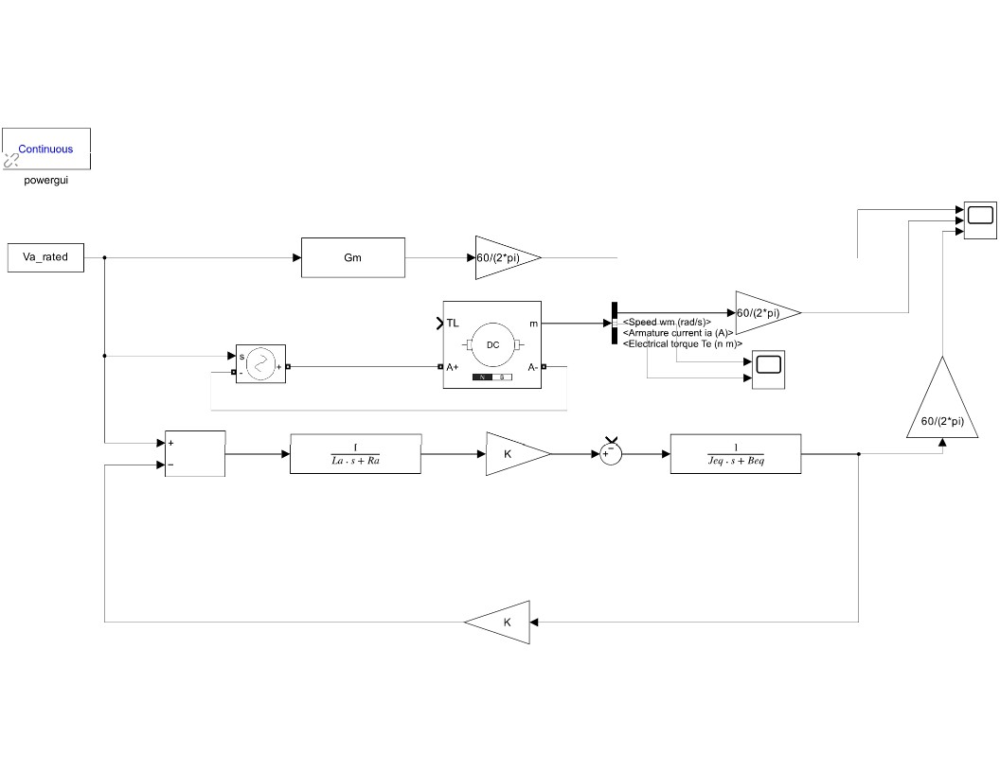
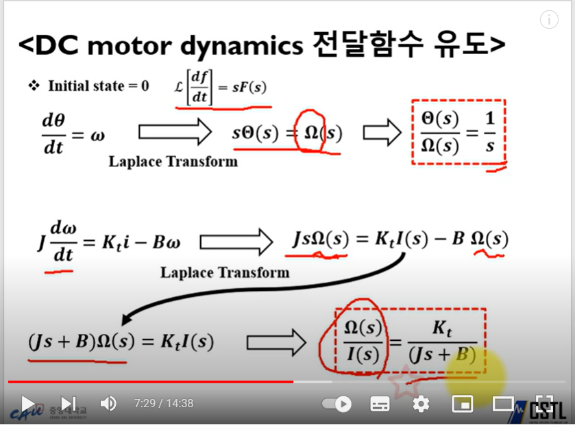
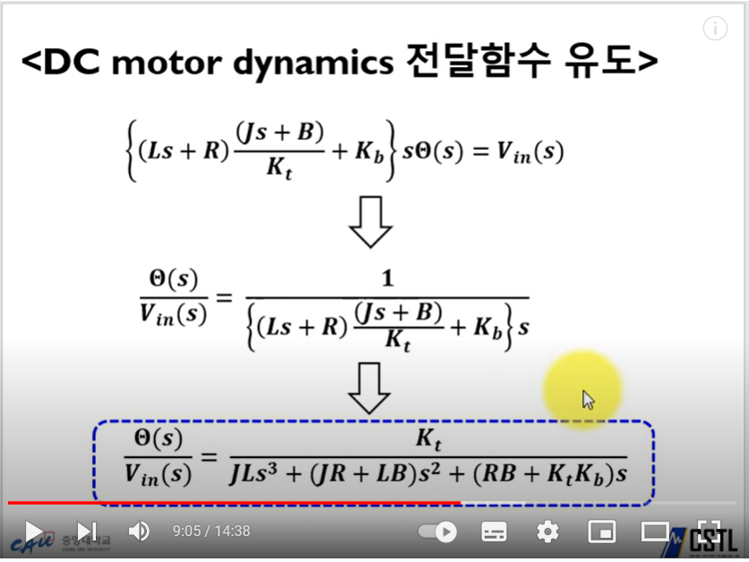

### Laplace Transform
최종식에서 sθ(s)  =  w(s), 같은 K값을 적용하면 

###### Gm = w(s)/Vi (120[Volt])
###### Gm = (K/(Jeq*La))/(s^2 + ((Ra/La)*s + (Beq/Jeq)*s) + ((Ra*Beq)/(Jeq*La) + K*K/(Jeq*La))); 

### PMDC motor

